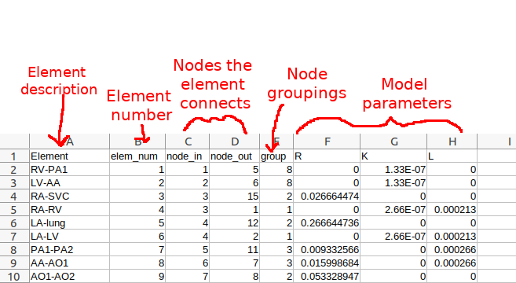
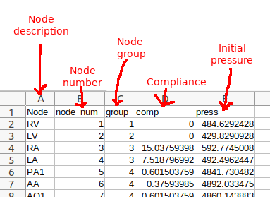

=============================================================
Example - Running the fetal model with an anatomical placenta
=============================================================

This example is found in the directory placenta-simulations/fetal/fetal_example

The example requires that you have the reprosim libraries installed on your machine. You can find installation instructions
`here <https://reprosim.readthedocs.io/en/latest/index.html#>`_ and the libraries themselves `here <https://github.com/virtualPregnancy/reprosim>`_.

If you work in virtual environments, activate a virtual environment in which reprosim is installed and execute the following:

You will also need to make sure you have the following python libraries installed:

- numpy

- placentagen (found `here <https://github.com/virtualPregnancy/placentagen>`_)

- csv

- matplotlib

.. code-block:: console

    python run_fetal.py

This executes the file that runs the example (run_fetal.py). If you open this file you'll see that the code has a requirement

.. code-block:: python

    import os
    import numpy as np
    import placentagen as pg
    import csv
    from matplotlib import pyplot as plt

These are packages you should have installed on your computer. The os package often comes with your python install, but if not can be installed using pip.

The next lines of code tell you which parts of the reprosim libraries we are going to use:

.. code-block:: python

    from reprosim.diagnostics import set_diagnostics_level
    from reprosim.indices import perfusion_indices, get_ne_radius
    from reprosim.geometry import append_units,define_node_geometry, define_1d_element_geometry,define_1d_element_placenta,define_rad_from_geom,add_matching_mesh, \
        define_capillary_model,define_rad_from_file
    from reprosim.repro_exports import export_1d_elem_geometry, export_node_geometry, export_1d_elem_field,export_node_field,export_terminal_perfusion
    from reprosim.fetal import assign_fetal_arrays, fetal_model

The next portion of the code sets up the parameterisation of the model, parameters related to the heart are defined directly within
the python script, and the geometry (nodes and elements that define the vascular connectivity in the fetal circulation) is defined
within two spreadsheets (.csv) files that need to be imported into reprosim libraries for the models to function.

The first lines of code are here to allow you to define the directory you want to export results to, they define the directory name, and if it doesnt exist on your system creates the directory.

.. code-block:: python

    export_directory = 'output'
    if not os.path.exists(export_directory):
        os.makedirs(export_directory)

Next, there are a number of numeric parameters that define the running of the model and the fetal heart model employed

.. code-block:: python
    dt=0.0001 #s, time step
    num_heart_beats=30 #number of heart beats to simulate

In this example, the numerical scheme will use a time step of 0.0001 s and simulate for 30 heart beats, evolving from
initial conditions.

The model parameters that relate to the heart are as follows:

.. code-block:: python

    T_beat = 0.43 # heart beat period (s)
    T_vs  = 0.215 # Time period of ventricular contraction (s)
    T_as = 0.1075 #Time period of atrial contraction (s)
    T_v_delay = 0.1075 #delay in ventrial contraction (compare to atria) (s)
    U0RV = 5332.89 #Pa
    EsysRV = 0.399967 #Pa/mm3
    EdiaRV = 0.0399967 #Pa/mm3
    RvRV = 0.010665 #Pa.s/mm3
    U0LV = 5332.89 #Pa
    EsysLV =0.399967 #Pa/mm3
    EdiaLV =0.0399967 #Pa/mm3
    RvLV = 0.010665 #Pa.s/mm3
    U0A = 399.967 #Pa
    V0V = 8000.  # mm3 - volume of ventricles (initial)
    V0A = 3000.  # mm3 - volume of atria (initial)
    human_weight = 3.0255 #kg Not used, but current parameterisation assumes an average fetal weight and allometric scaling may be useful in future

Next, the code reads in a .csv file defining element properties:

.. code-block:: python

    elem_file = 'elemProperties.csv'
    file = open(elem_file)
    elem_properties = csv.reader(file)
    header = next(elem_properties)
    rows = []
    for row in elem_properties:
        rows.append(row)
    file.close()
    elem_identifiers = np.empty(len(rows),dtype=np.dtype('U10'))
    elems = np.empty((len(rows),3),dtype=int)
    group = np.empty(len(rows),dtype=int)
    resistance = np.empty(len(rows),dtype=np.dtype('d'))
    L= np.empty(len(rows),dtype=np.dtype('d'))
    K = np.empty(len(rows),dtype=np.dtype('d'))
    for i in range(0,len(rows)):
        elem_identifiers[i] = rows[i][0]
        elems[i,0]=int(rows[i][1])-1
        elems[i,1]=int(rows[i][2])-1
        elems[i,2]=int(rows[i][3])-1
        resistance[i]=np.double(rows[i][header.index('R')])
        group[i]=int(rows[i][header.index('group')])
        L[i]=np.double(rows[i][header.index('L')])
        K[i]=np.double(rows[i][header.index('K')])

   The contents of elemProperties.csv.

Of importance to how the model works is the element groupings defined in elemProperties.csv. These are:

#. Cardiac valves.

#. A *resistor only* element, not connected to the placenta

#. A *resistor* combined with an *inductor*

#. The foramen ovale.

#. A *resistor* combined with a *flow dependent* dissipation.

#.  A *resistor* combined with a *flow dependent* dissipation and an *inductor*.

#. Elements that feed the circulation from the heart (exits the ventricles).

#. A dummy argument to allow for future additions to the model (do not use).

#. The umbilical artery (feeding the anatomic placenta). A *resistor only* element.

#. The umbilical vein (exiting the anatomic placenta). A *resistor only* element.

Next, each element's properties are converted to reprosim (and cmgui) readable files:

.. code-block:: python

    pg.export_ipelem_1d(elems, 'fetal', export_directory + '/fetal')
    pg.export_exfield_1d_linear(resistance, 'fetal', 'resistance', export_directory +'/R')
    pg.export_exfield_1d_linear(group, 'fetal', 'group', export_directory + '/group')
    pg.export_exfield_1d_linear(L, 'fetal', 'L', export_directory + '/L')
    pg.export_exfield_1d_linear(K, 'fetal', 'K', export_directory + '/K')

The node properties are now read into the code and converted into reprosim readable files:

.. code-block:: python

    node_file = 'nodeProperties.csv'
    file = open(node_file)
    node_properties = csv.reader(file)
    header = next(node_properties)
    rows = []
    for row in node_properties:
        rows.append(row)
    file.close()
    nodes = np.empty((len(rows),4),dtype=np.dtype('d'))
    node_identifiers = np.empty(len(rows),dtype=np.dtype('U10'))
    for i in range(0,len(rows)):
        node_identifiers[i] = rows[i][0]
        nodes[i,0]=np.double(rows[i][1])-1
        nodes[i,1]=np.double(rows[i][header.index('group')])
        nodes[i,2]=np.double(rows[i][header.index('press')])
        nodes[i,3]=np.double(rows[i][header.index('comp')])

    pg.export_ip_coords(nodes[:,1:4], 'fetal', export_directory +'/fetal')

   The contents of nodeProperties.csv.

Just like with element groups, the node groups in nodeProperties.csv are important. They are defined as:

#. Right ventricle

#. Left ventricle

#. Atria

#. All other vessels or vascular beds

The main portion of the code comes next. Within reprosim, we can chose how much diagnostic information we want to print to screen as we run the code. Thre are three levels of diagnostics (level 0 - no diagnostics; level 1 - only prints subroutine names (default); level 2 - prints subroutine names and contents of variables). To set this level we simply use:

.. code-block:: python

	set_diagnostics_level(0)

We then set up a perfusion model type - this part of the code simply tells the solver we are looking at a perfusion simulation and allows it to determine how much memory is needed to do this:

.. code-block:: python

	    perfusion_indices()

Next we set up the geometry that we are going to solve the model in. The first thing we read in is the fetal circulation
architecture which has been converted from csv files to be reprosim readable:

.. code-block:: python

    define_node_geometry(export_directory +'/fetal.ipnode')
    define_1d_element_geometry(export_directory + '/fetal.ipelem')
    assign_fetal_arrays()

We then need to define the placenta itself. This involves reading in, or generating a tree-like structure.
In this example we read in a geometry from the 'sample_geometry' directory:

.. code-block:: python

    define_node_geometry('sample_geometry/FullTree.ipnode')
    define_1d_element_placenta('sample_geometry/FullTree.ipelem')
	append_units()

Here, nodes are the location of the start and end points of branches in our geometry and elements define the centrelines of these branches. The append_units command tells the code where our capillary bed sits within our geometry.

In many cases we have a really good description of what our arteral geometry looks like, but we need to make some assumptions about what the veins look like. In this case we simply copy the arteries:

.. code-block:: python

    umbilical_elem_option = 'same_as_arterial'
    umbilical_elements = []
    add_matching_mesh(umbilical_elem_option,umbilical_elements)

We now have a mesh that includes arteries, capillaries and veins, and we have to define the size of these vessels. We do this using Strahler ordering systems:

.. code-block:: python

    # define radius by Strahler order in diverging (arterial mesh)
    s_ratio = 1.38  # rate of decrease in radius at each order of the arterial tree  1.38
    inlet_rad = 1.8  # inlet radius
    order_system = 'strahler'
    order_options = 'arterial'
    name = 'inlet'
    define_rad_from_geom(order_system, s_ratio, name, inlet_rad, order_options, '')
    #defines radius by STrahler order in converging (venous mesh)
    s_ratio_ven= 1.46 #rate of decrease in radius at each order of the venous tree 1.46
    inlet_rad_ven=4.0 #inlet radius
    order_system = 'strahler'
    order_options = 'venous'
    first_ven_no='' #number of elements read in plus one
    last_ven_no='' #2x the original number of elements + number of connections
    define_rad_from_geom(order_system, s_ratio_ven, first_ven_no, inlet_rad_ven, order_options,last_ven_no)

    num_convolutes = 6  # number of terminal convolute connections
    num_generations = 3  # number of generations of symmetric intermediate villous trees
    calc_capillary_unit_length(num_convolutes,num_generations)

Finally, we solve the model (bringing in information about heart and where to export files):

.. code-block:: python

    fetal_model(export_directory+'/',dt,num_heart_beats,T_beat,T_vs,T_as,T_v_delay,U0RV,EsysRV,EdiaRV,RvRV,U0LV,EsysLV,EdiaLV,RvLV,U0A,V0V,V0A)

The remainder of the code exports provides some plots of blood flow velocity in major vessels.  Examples of these plots are given in the expected-results folder.