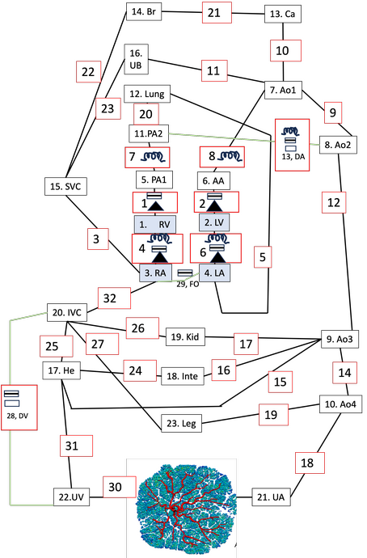

==========
The theory
==========

This model is not yet published, however, it draws upon previously published work. In particular, there is
compartmentalisation of the fetal circulation that follows

#. Pennati GI, Bellotti M, Fumero RO. `Mathematical modelling of the human foetal cardiovascular system based on Doppler ultrasound data <https://doi.org/10.1016/S1350-4533(97)84634-6>`_. Medical engineering & physics. 1997 Jun 1;19(4):327-35.

which is coupled to a feto-placental circulation model, following

#. Clark AR, Lin M, Tawhai M, Saghian R, James JL. `Multiscale modelling of the feto–placental vasculature <https://doi.org/10.1098/rsfs.2014.0078>`_. Interface focus. 2015 Apr 6;5(2):20140078.

The basics
==========

The model is a compartmental model, described by the diagram below:

   Compartmentalised model of the fetal vasculature. Lines represent elements through which there is flow, with green lines being unique to the fetal circulation. Dissapative nodes exist at the connections between elements.

In the figure, green lines are vessels that are present only in the fetus, and black lines are vessels that are present in the fetus
and the adult.

A resistive element is present in all elements (green or black lines, and element numbers are within red bounding boxes), and is shown symbolically where present together with another electrical analogue
element (i.e. the vessel has significant fluid intertia). A box with a black line within it is an inductor, representing a non-negligible fluid inertia. A box with black
boundary edges (no number within the box) indicates that a vessel has a significant flow dependent influence on resistance (i.e. where increasing flow
can lead to disruption to flow patterns near a bifurcation, increasing resistance, or where a valve is present. A black triangle represents a one way valve. The box with black boundaries
and one way valves are both defined mathematically by a phenomenological representation of flow disruptions.
Finally, a numbered box with black boundary edges represents a node. Each node is a capacitor, representing the compliance of a vessel or vascular bed.

The nodal compartments within the fetal model are then abbreviated by:

#. RV = Right ventricle

#. LV = Left ventricle

#. RA = Right atrium

#. RV = Right ventricle

#. PA1 = pulmonary artery segment 1 (vessel representation)

#. AA = Aortic arch (vessel representation)

#. AO1 = Aorta segment 1 (vessel representation)

#. AO2 = Aorta segment 2 (vessel representation)

#. AO3 = Aorta segment 3 (vessel representation)

#. AO4 =Aorta segment 4 (vessel representation)

#. PA2 = Pulmonary artery segent 2 (vessel representation)

#. LUNG = Lung vascular bed

#. CA = Cerebral artery (vessel representation)

#. BR = Brain vascular bed

#. SVC = Superior vena cava (vessel representation)

#. UB = Upper body vascular bed

#. HE = Hepatic system vascular bed

#. INTE = Intestinal vascular system

#. KID = Kidney vascular bed

#. IVC = inferior vena cava (vessel representation)

#. PLAC = placenta, full anatomic model (Clark et al. 2015)

#. Umbilical vein (vessel representation)

#. LEG = Leg/lower body vascular system.

The ductus venosus (DV) connects the umbilical vein to the IVC. The ductus arteriosus (DA) connects the pulmonary artery to the aorta.
The foramen ovale (FO) connects the distal IVC to the left atrium.

Heart Model
###########

The heart model follows `Pennati et al. <https://doi.org/10.1016/S1350-4533(97)84634-6>`_ and generates a pressure waveform in the ventricles and atria based on a time dependent activation function, assumed ‘elastances’
and time dependent changes in chamber volume driven by the pressure differentials that are established through the system. In the
ventricles:

 :math:`p_V(t) = U_0 A_V(t)+(E_{V,dia} + E_{V,sys} A_V(t)) V_V(t) + R_V \frac{dV_v(t)}{dt},`

where  :math:`U_0` (pressure units) is the isovolumic pressure generator constant, :math:`A_V(t)` is a defined activation function
with values between 0 and 1 (reflecting contraction of the heart), :math:`E_{V,dia}` is the diastolic elastance,
:math:`E_{V,sys}` is the systolic elastance, :math:`V_V`  is ventricular volume, and :math:`R_V` is resistance of the ventricle.
The activation function is defined as

:math:`A(t) = \sin \left( \frac{\pi}{T_{V,S}} (t-T_{V,delay}) \right),` when :math:`T_{V,delay} \le t \le T_{V,delay}+T_{V,S},`

and :math:`A(t)=0` outside of this time period.

In the atria

:math:`p_A(t) = U_0 A_A(t)+ \frac{V_A(t)}{C_A},`

where :math:`p,U,A,V` have the same definition as in the ventricles, and :math:`C_A` is atrial compliance.
Atrial activation is offset from ventricular activation, as there is no delay term (:math:`T_{V,delay}`) to atrial
activation.

Laws for each compartment
#########################
Each compartment can be thought of as an energy transfer process. Nodes are an energy storage unit – pressure/compliance interactions. The elements are dissipative (flow across a resistor given a driving pressure.

Each compartment in the model is defined by a flow in (:math:`Q_{in}`), flow out (:math:`Q_{out}`),
and a pressure in (:math:`p_{in}`).and pressure out (:math:`p_{out}`).

For node compartments :math:`p_{in}=p_{out}=p`  and the following relationship holds

:math:`Q_{in} -Q_{out} = C \frac{dp}{dt},`

For elements :math:`Q_{in}=Q_{out}=Q`, and a pressure drop is defined by summing effects due to vessel resistance R, inertia, L and other dissipative effects (note that not all terms appear in all vessels, simple resistance vessels just have the RQ term)

:math:`p_{in}-p_{out} = RQ + L\frac{dQ}{dt} + k Q^{\beta},`

where R is vessel resistance, L is inertance, and :math:`k` and :math:`\beta` are constants.
Note that flow is restricted to be one way in the FO into the LA.

In vessel sections, R, L and C can be derived from vessel radius and length (i.e. Poiseulle resistance defines R).

:math:`R = \frac{8\mu L}{\pi r^4},`
where :math:`\mu` is viscosity of blood, L is the length of the blood vessel and r is the radius of the blood vessel.

:math:`L = \frac{\rho L}{\pi r^2},`
where :math:`\rho` is density.

:math:`C = \frac{3 \pi r^3 L}{2 E h},`
where :math:`E` is the Young's modulus for the vessel wall, and :math:`h` is the thickness of the vessel wall.

In this compartmentalised model only the largest vessels are defined explicitly, and there are a number of `vascular bed`
compartments. These compartments cannot be defined by a radius and length, as above, and so their resistance, compliance and
inertance values are defined based on literature and/or fit to Doppler data.

The placenta is represented by a network of vessels (see examples showing feto-placental model development) and
within this model the placental resistance is calculated by serial and parallel addition of vessels within the network
explicitly.