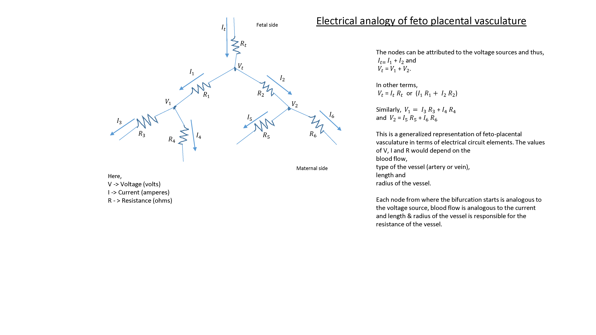

==========
The theory
==========

Publications containing detailed descriptions of the theory employed in this model:

 - `Clark et al. Interface, 2015 <http://rsfs.royalsocietypublishing.org/content/5/2/20140078>`_.
 
Please remember to cite these papers if using our softwares.

.. Publications using these models include:

Publications using these models include:

 - `Clark et al. Interface, 2015 <http://rsfs.royalsocietypublishing.org/content/5/2/20140078>`_.
 - `Tun et al. Scientific Reports, 2019 <https://www.nature.com/articles/s41598-019-46151-6>`_.

Theses using these models include:

 - `Win Min Tun, PhD, 2019 <https://catalogue.library.auckland.ac.nz/primo-explore/fulldisplay?docid=uoa_alma21309234220002091&vid=NEWUI&context=L>`_.
 - `Monika Byrne, ME, 2019 <https://catalogue.library.auckland.ac.nz/primo-explore/fulldisplay?docid=uoa_alma21301245550002091&vid=NEWUI&context=L>`_.

The basics
==========

Electrical circuit analogy of feto-placental vasculature
########################################################

An electrical circuit analogy of the feto-placental vasculature is used to transform the hemodynamics of the placental blood flow to an equivalent electric circuit `Clark et al. Interface, 2015 <http://rsfs.royalsocietypublishing.org/content/5/2/20140078>`_. The physical/mechanical parameters are represented as their equivalent electrical circuit elements summarised in the table below. The pressure drop in each vessel :math:`\Delta P` can be related to the volumetric flow of blood through the vessel (Q) by the equation :math:`\Delta P=QR`, with R being the resistance of the vessel. This is equivalent to V=IR in electrical circuit theory. Under certain assumptions we can assume that :math:`\Delta P=QR` in every placental blood vessel and calculate the distribution of blood flow and pressure in the vascular network from this basis.

+--------------------------------+-------------------------------+
| MECHANICAL PARAMETERS          | ELECTRICAL PARAMETERS         |
+================================+===============================+
| Pressure (P)                   | Voltage/Electric potential (V)|
+--------------------------------+-------------------------------+
| Length(L) and Radius(r)        | Resistance (R)                |
+--------------------------------+-------------------------------+
| Blood flow rate (Q)            | Current (I or Q/t)            |
+--------------------------------+-------------------------------+

The feto-placental vascular structure is a large and complex vascular branching network, which consists of over 15 bifurcating generations of blood vessels. In feto-placental vasculature, the two umbilical arteries and one umbilical vein, becomes the chorionic arteries and veins respectively from the umbilical cord insertion point. The chorionic vessels are visible on the chorionic surface, further bifurcates into smaller vessels at different levels with length and radius reduced at each level. In each blood vessel we assume that  :math:`\Delta P=QR` and at each bifurcation we assume a fixed pressure (fixed voltage in electrical terms) and that flow is conserved (flow IN = flow OUT or in electrical terms current IN = current OUT). If we know two boundary conditions (i.e total blood flow into the system and pressure in the umbilical vein) we can then calculate the flow through every branch in the system and pressure at every bifurcation by considering the resistance of vessels in series and in parallel (see figure 3.1).

   Generalized representation of feto-placental vasculature.

To simulate flow through the system, we need to have a realistic mechanical description of the resistance of each vessel. If we assume that flow in the vessels is steady (which is required to use the DC circuit analogy), that flow is laminar and fully developed we can use a Poiseuille approximation to determine the resistance of each blood vessel. Any blood vessel with certain length and radius has resistance given by:

 :math:`R = \frac{8\mu L}{\pi r^4}`
where :math:`\mu` is viscosity of blood, L is the length of the blood vessel and r is the radius of the blood vessel.

If w consider the electrical resistance of any conductor (blood vessel in this case), we can see how the definition of Poiseuille resistance makes sense:

 :math:`R = \frac{\rho L}{A}`
where  :math:`\rho` is the conductivity, R is the electrical resistance,  L is the length of the vessel and A is the area of cross section of the vessel.

Now, after re-writing the poiseuille's resistance in terms of electrical resistance would result in:

 :math:`R = \frac{8\mu L}{\pi r^2}`
where :math:`\mu` is the blood viscosity, R is the electrical resistance,  L is the length of the vessel, A is the area of cross section of the vessel and r is the radius of the vessel.

In feto-placental vasculature, the two umbilical arteries and one umbilical vein, becomes chorionic arteries and veins respectively from the umbilical cord insertion point. The chorionic vessels that are visible on the chorionic surface, further bifurcates into smaller vessels at different levels with length and radius reduced at each level. The pressure drop at any node would be equal to the sum of the pressures along the bifurcating branches.