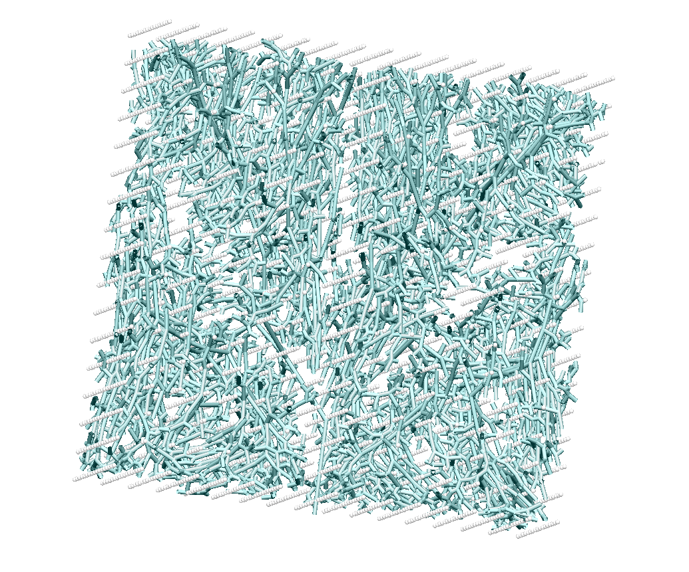
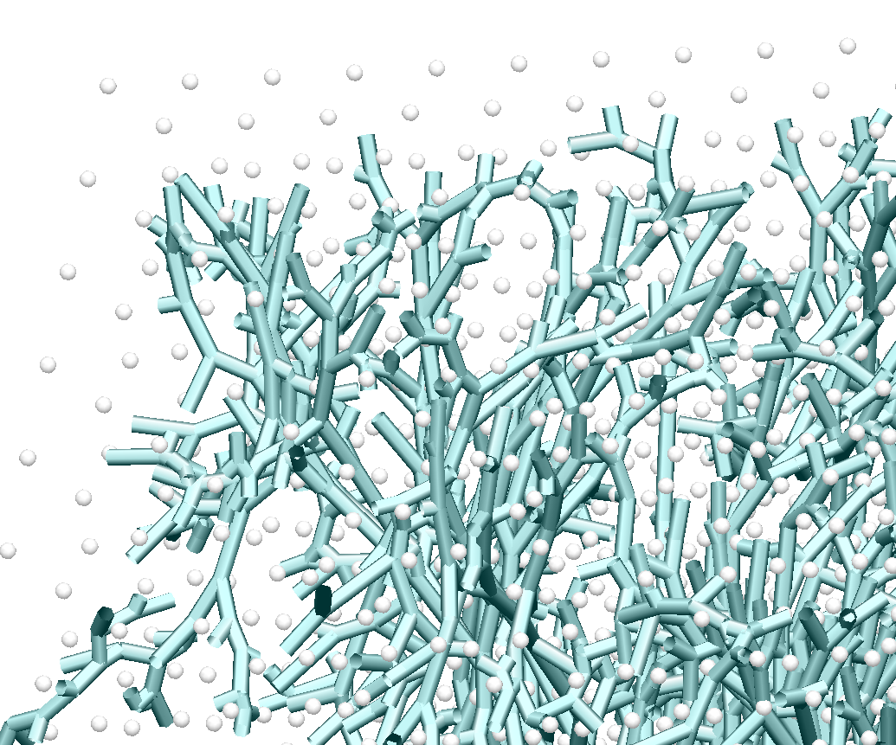

================================================
Generating a tree structure that fills an cuboid
================================================

This example is found in the directory placenta-simulations/geometry/grow-tree-cuboid

The example requires that you have numpy installed on your machine, and the placentagen libraries.

If you work in virtual environments, activate a virtual environment in which placentagen is installed and execute the following:

.. code-block:: console

    python grow-tree.py
	
	
This executes the file that runs the example (grow-tree.py). If you open this file you'll see that the code has a number of requirements

.. code-block:: python 

	import os
	import placentagen as pg
	import numpy as np

These are packages you should have installed on your computer. For os and numpy, these often come with your python install, but if not can be installed using pip. The package placentagen is developed in house, and details on how to install can be found `at this link <https://github.com/VirturalPregnancy/placentagen.git>`_.

Once you are confident that you have all these packages installed, run the script. The results should write to a new directory (output) and have a look at the visualisation in cmgui (visualise.com). This is similar to what you should see:

   
   What results of growing into a cuboid should look like in cmgui.
	
	

   
   What results of growing into a cuboid should look like in cmgui (zoomed).
	   

The cyan tubes are the branches of the tree, and the grey/white dots are the data points associated with each terminal
element of the tree (numbered as the element numbers). Note, that due to constraints that you impose on growing,
not every data point that was originally generated within your volume will have a terminal element associated,
and so their number will be fewer than your original seed point density.

The results that you now have in the output directory can be compared to those in the repository in expected-results. This folder contains what your code should output if run in exactly the same way as in the 

Now we know that the code works, we can begin to make changes. The first set of parameters is all about defining the shape 
of the cuboid we are growing into. This is always defined by the same three parameters:

.. code-block:: python 

	#Define the dimensions of the cuboid
    x_dim = 10.0 #mm
    y_dim = 10.0 #mm
    z_dim = 10.0 #mm

In this example we (arbitrarily) define a 10x10x10 mm cuboid.
	
The next part defines the parameters that will give you an initial tree to grow from:

We then have a block of code that defines branching parameters

.. code-block:: python

    #number of seed points
    n_seed = 5000.
    #Length of stem villi
    sv_length = 2.0
    #Maximum angle between two branches
    angle_max_ft =  100 * np.pi /180
    #Minimum angle between two branches
    angle_min_ft = 0 * np.pi /180
    #Fraction that the branch grows toward data group centre of mass at each iteration
    fraction_ft =   0.4
    #Minimum length of a branch
    min_length_ft =  0.1 #mm
    #minimum number of data points that can be in any group after a data splitting proceedure
    point_limit_ft =  1

	
Finally there are some controls on export parameters. In general you just want to see the final results, but there are options to export intermedate steps of the process so you can understand how each step in the algorithm builds on the last.

.. code-block:: python

	#If you want to see how each step in the process builds on the last set this to be true
	export_intermediates = False
	#If you want final results set this to be true
	export_results = True
	#Define a directory to export (do not write over expected-results unless you have made a (peer-reviewed) change to the process)
	export_directory = 'output'
	
We now get into the creation of the geometry. 

Step 1 - Define a seed geometry from which to grow (stem villi)
---------------------------------------------------------------

In this example we chose a very simple representation of the seed geometry. It is simply three branches, with end points
determined by the size of the cuboid.

.. code-block:: python

	seed_geom = {}
    seed_geom["nodes"] = np.asarray([[0,0,0,-z_dim/2.],[1,0,0,-z_dim/2.+sv_length],[2,0,fraction_ft*y_dim/4.,(-1+fraction_ft)*z_dim/2.+(1-fraction_ft)*sv_length],[3,0,-fraction_ft*y_dim/4,(-1+fraction_ft)*z_dim/2.+(1-fraction_ft)*sv_length]])
    seed_geom["elems"] = np.asarray([[0,0,1],[1,1,2],[2,1,3]])

We then use some inbuilt placentagen functions to determine the connectivity of these manually defined seed vessels

.. code-block:: python

    elem_connectivity = pg.element_connectivity_1D(seed_geom["nodes"][:,1:4], seed_geom["elems"])
    seed_geom["elem_up"]= elem_connectivity["elem_up"]
    seed_geom["elem_down"] = elem_connectivity["elem_down"]

Step 2 - Create a uniformly spaced set of seed points within the cuboid
-----------------------------------------------------------------------

Next we use placentagen to define a uniformly spaced set of seedpoints that aims to fill the cuboid

.. code-block:: python

	datapoints_villi=pg.equispaced_data_in_cuboid(n_seed,x_dim,y_dim,z_dim)
    if(export_intermediates):
        export_file = export_directory + '/villous_data'
	

Step 3 - Grow into volume
--------------------------

This is the part of the code where the full volume filling branching algorithm is implemented.
This takes your initial seed geometry (from step 1) and grows new arteries from this geometry to fill an cuboidal volume.
 The following commands do the job:

.. code-block:: python 

    #Now grow a tree to these data points, optimised for larger trees
    random_seed = 1
    full_geom=pg.grow_large_tree(angle_max_ft, angle_min_ft, fraction_ft, min_length_ft, point_limit_ft, 0, 0, 0, datapoints_villi, seed_geom, random_seed)

Note that the random seed can be changed, but holding it constant generates the same tree every time.

Finally, the code exports three files, the node and element file defining the full branching tree, and a data file which defines which data points have been associated with a 'terminal element' - i.e. the effective location of tissue associated with each terminal element.

