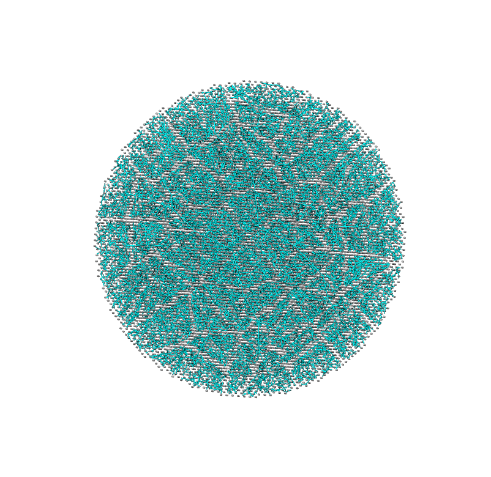
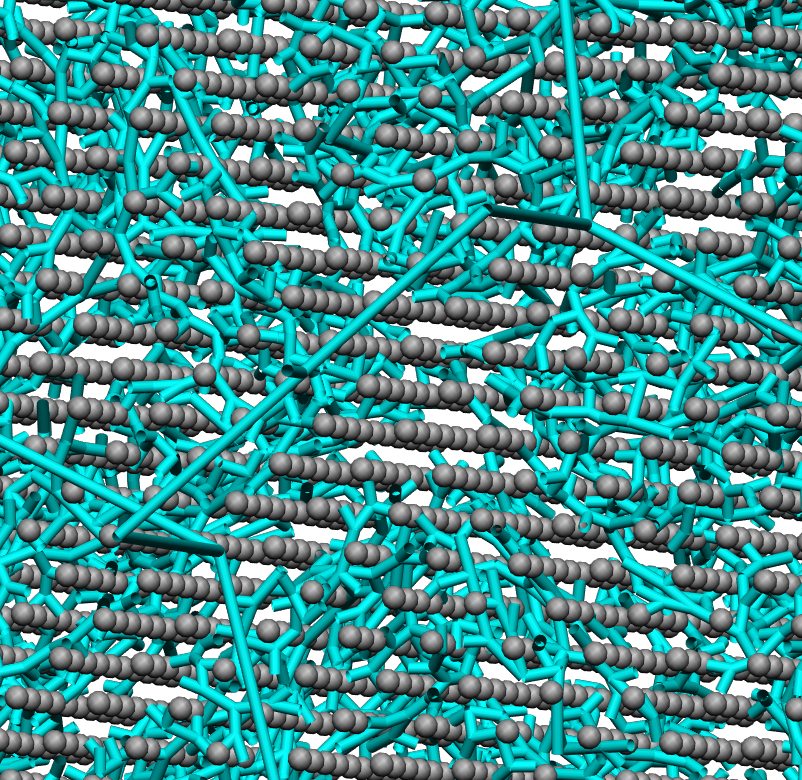

===============================================================
Generating a tree structure that fills an ellipsoid
===============================================================

This example is found in the directory placenta-simulations/geometry/grow-tree-ellipsoid

The example requires that you have numpy installed on your machine, and the placentagen libraries.

If you work in virtual environments, activate a virtual environment in which placentagen is installed and execute the following:

.. code-block:: console

    python grow-tree.py
	
	
This executes the file that runs the example (grow-tree.py). If you open this file you'll see that the code has a number of requirements

.. code-block:: python 

	import os
	import placentagen as pg
	import numpy as np

These are packages you should have installed on your computer. For os and numpy, these often come with your python install, but if not can be installed using pip. The package placentagen is developed in house, and details on how to install can be found `at this link <https://github.com/VirturalPregnancy/placentagen.git>`_.

Once you are confident that you have all these packages installed, run the script. The results should write to a new directory (output) and have a look at the visualisation in cmgui (visualise.com). This is similar to what you should see:

   
   What results of growing into an ellipsoid should look like in cmgui.
	
	

   
   What results of growing into an ellipsoid should look like in cmgui (zoomed).
	   

The cyan tubes are the branches of the tree, and the grey dots are the data points associated with each terminal element of the tree (numbered as the element numbers). Note, that due to contsraints that you impose on growing, not every data point that was originally generated within your volume will have a terminal element associated, and so their number will be fewer than your original seed point density.

The results that you now have in the output directory can be compared to those in the repository in expected-results. This folder contains what your code should output if run in exactly the same way as in the 

Now we know that the code works, we can begin to make changes. The first set of parameters is all about defining the shape of the ellipsoid we are growing into. This is always defined by the same three parameters:

.. code-block:: python 

	#volume of ellipsoid 
	volume=427.0*1000 #mm^3
	#thickness of ellipsoid (z-axis dimension)
	thickness=24.8 #mm
	#ellipticity  - ratio of y to x axis dimensions
	ellipticity=1.00 #no units
	
The next part defines the parameters that will give you an initial tree to grow from:

.. code-block:: python

	#x and y coordinates of cord insertion point
	cord_insertion_x=0.0
	cord_insertion_y=0.0
	#distance between the two umbilical arteries
	umb_artery_distance=20.0 #mm
	#length of umbilical artery included in the model
	umb_artery_length=20.0
	
We then have two blocks of code that define branching parameters, the first determine how branching will be structured over the chorionic surface (branches grow over the surface of the ellipsoid):

.. code-block:: python

	#Number of chorionic seed points targeted
	n_chorion=32
	#Maximum angle between two branches	
	angle_max =  90 * np.pi /180
	#Minimum angle between two branches
	angle_min = 5 * np.pi /180
	#Fraction that the branch grows toward data group centre of mass at each iteration
	fraction_chorion =   0.5
	#Minimum length of a branch
	min_length =  5.0 #mm
	#minimum number of data points that can be in any group after a data splitting proceedure
	point_limit =  1
	#Length of stem villi
	sv_length = 2.0
	
The second part of the growing is a volume filling algorithm and vessels will branch through the ellipsoid. The required branching pattern may differ here to in the larger chorionic branches and so parameters can be defined seperately.

.. code-block:: python

	#Number of seed points targeted for growing tree
	n_seed=32000
	#Maximum angle between two branches
	angle_max_ft =  100 * np.pi /180
	#Minimum angle between two branches
	angle_min_ft = 0 * np.pi /180
	#Fraction that the branch grows toward data group centre of mass at each iteration
	fraction_ft =   0.4
	#Minimum length of a branch
	min_length_ft =  1.0 #mm
	#minimum number of data points that can be in any group after a data splitting proceedure
	point_limit_ft =  1
	
Finally there are some controls on export parameters. In general you just want to see the final results, but there are options to export intermedate steps of the process so you can understand how each step in the algorithm builds on the last.

.. code-block:: python

	#If you want to see how each step in the process builds on the last set this to be true
	export_intermediates = False
	#If you want final results set this to be true
	export_results = True
	#Define a directory to export (do not write over expected-results unless you have made a (peer-reviewed) change to the process)
	export_directory = 'output'
	
We now get into the creation of the geometry. 

Step 1 - Define a seed geometry from which to grow
--------------------------------------------------

In this example we chose a very simple representation of the umbilical cord, and assume that we dont have any information about the individual. This seed geometry can, in practice, take on any level of detail. It could be an entire chorionic vasculature from imaging, it could be an almost complete tree (particularly in animal models). If you have data from imaging you need to import this to the growing algorithm at this stage. In this particular example though we pick coordinates of the cord insertion point and generate a single generation from that point to begin the growing process. This generation step is implemented in two parts via placentagen. First we define a set of data points that cover one surface of ellipsoid

.. code-block:: python

	datapoints_chorion=pg.uniform_data_on_ellipsoid(n_chorion,volume,thickness,ellipticity,0)

Then we generate the insertion of the umbilical cord segment 

.. code-block:: python

	seed_geom=pg.umbilical_seed_geometry(volume,thickness,ellipticity,cord_insertion_x,cord_insertion_y,umb_artery_distance,umb_artery_length,datapoints_chorion)

Step 2 - Grow branches over the 'chorionic surface' 
---------------------------------------------------

The same surface of the ellipsoid into which the umbilical cord inserts becomes the chorionic surface. This example now grows branches over this surface based on the data points and seed geometry defined in step 1. Again, we use placentagen.

.. code-block:: python

	chorion_geom=pg.grow_chorionic_surface(angle_max, angle_min, fraction_chorion, min_length, point_limit,volume, thickness, ellipticity, datapoints_chorion, seed_geom,'surface')

Step 3 - Create 'stem villi'
----------------------------

If we have generated a chorionic vasculature, there will be no stem villi that stick up into the villous tissue. We need to generate these. To do this we refine the elements in the tree created in step 2 once and add some stem villi at the new nodes. The refine step looks like this 

.. code-block:: python

	#Refine once from defined element number (dont refine umbilical cord)
	from_elem=5
	#define whether to project onto an ellipsoidal surface (refine code works without projection too, but will just keep split elements with their original structure)
	project={}
	project['status'] = True
	project['z_radius'] =thickness/2.0
	project['x_radius']=np.sqrt(volume * 3.0 / (4.0 * np.pi * ellipticity * project['z_radius'] ))
	project['y_radius'] =ellipticity * project['x_radius']
	#actual refine step.
	refined_geom=pg.refine_1D(chorion_geom,from_elem,project)
	
and the addition of stem villi like this:

.. code-block:: python

	chorion_and_stem = pg.add_stem_villi(refined_geom,from_elem,sv_length,False, 'stem_xy.txt')
	

Step 4 - Grow into volume
--------------------------

This is the part of the code where the full volume filling branching algorithm is implemented. If you have an existing tree structure (e.g. from imaging) and have read this in, this may be the only part of the code you need to run. This takes your chorionic arteries (from step 3) and grows new arteries from this geometry to fill an ellipsoidal volume. Note that this takes some time using placentagen as we are not using precompiled code. The following commands do the job:

.. code-block:: python 

	full_geom=pg.grow_large_tree(angle_max_ft, angle_min_ft, fraction_ft, min_length_ft, point_limit_ft, volume, thickness, ellipticity, datapoints_villi, chorion_and_stem)

Finally, the code exports three files, the node and element file defining the full branching tree, and a data file which defines which data points have been associated with a 'terminal element' - i.e. the effective location of tissue associated with each terminal element.

